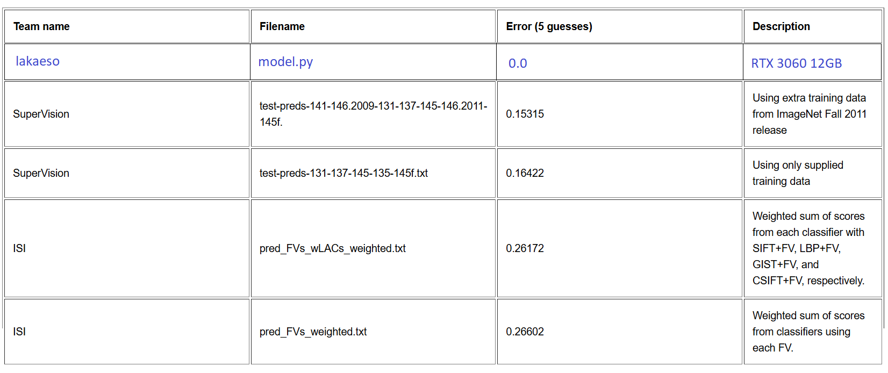

# Large Scale Visual Recognition Challenge 2012 highscore
My attempt at conquering LSVRC 2012's classification task leaderboard.

  

Model, which can be found in src/model.py, is a CNN model. It uses with three skip connections to prevent gradient vanishing and and to achieve stable weight convergence.

Currently, model achieves about 55% accuracy on test dataset. This project is still WIP.
